<div align="center">


# Luma

**Light by Darkness**

A native macOS AI teaching assistant that lives beside your cursor.
Watches your screen, guides you step by step, and teaches you anything — right where you work.


</div>

---

## What is Luma?

Luma is a native macOS AI companion built for learners, developers, creatives, and everyone in between. It sits in your menu bar, follows your cursor with a floating companion bubble, and uses the macOS Accessibility API alongside real-time screen analysis to watch what's happening on your screen.

Tell Luma what you want to do. It breaks the task into steps, points at exactly what to click, watches for your actions, validates each one, and corrects you if you go off track — until the task is complete. Like having a senior developer or designer sitting right next to you, except it's always there, it never judges you, and it works with your own API keys so your data stays yours.

v3.0 adds **Luma Agent** — a full autonomous multi-agent system. Spawn named agents that run long tasks in the background using the Claude CLI or Claude API, each with its own transcript, accent theme, and status. Manage them from a floating dock and HUD panel while you keep working.

The entire system is built to be frugal with API calls. Most of what Luma does — nudging you, detecting elements, compressing your voice input — runs completely on-device with zero API cost. Claude is reserved for reasoning: planning your steps, verifying progress, and locating elements when on-device methods fall short.

---

## Features

### Core Experience
- **Interactive Walkthroughs** — Press `Ctrl + Option`, speak your goal naturally, and Luma generates a step-by-step guided walkthrough. It watches your screen in real time, validates each action, corrects wrong moves offline, and nudges you if you go idle — with minimal API usage throughout.
- **Voice Input** — Speak to Luma via Apple Speech (SFSpeechRecognizer). Fully on-device, instant, no third-party transcription service or API key required.
- **Prompt Compression** — Before sending anything to Claude, Luma strips filler words from your transcript using an offline keyword filter. "Hey Luma can you please like help me compress my downloads folder" becomes "compress downloads folder" — reducing token usage by up to 60% per request.
- **Native TTS** — Luma speaks back using macOS AVSpeechSynthesizer. Coordinate strings like "point 400, 200" are automatically stripped before speaking so responses always sound natural. No ElevenLabs, no credits, no limits.
- **Request Override** — Speak a new request at any time. Luma immediately cancels the active walkthrough and responds to what you just said — no need to wait or manually cancel.
- **Custom Cursor** — A minimal black teardrop cursor replaces your system cursor while Luma is active — a subtle signal that your AI teacher is watching and ready.
- **Companion Bubble** — A floating translucent black bubble follows your cursor across the entire screen, showing Luma's responses and step instructions right where you're working.

### Intelligence & Detection
- **Triple-Validation Architecture** — Every element Luma points at is verified three ways before the cursor moves: Accessibility API scan, MobileNetV2 visual detection, and Claude coordinate verification. If any layer is uncertain, Luma waits rather than guessing.
- **LumaImageProcessingEngine** — The dual-source element detection system. Runs an Accessibility API tree scan and a MobileNetV2 screenshot classification simultaneously, cross-validates results, and picks the highest-confidence coordinate. Falls back gracefully when one source fails.
- **MobileNetV2 (Core ML)** — Apple's pre-trained MobileNetV2 model runs fully on-device. It crops a 160×160px region around Claude's target coordinate and classifies what's there before the cursor moves. Loaded from `MobileNetV2.mlmodel` — no internet required after first build.
- **AXDockItem Priority** — When searching for app icons, Luma correctly targets Dock items (AXDockItem) over menu bar items (AXMenuBarItem). If both exist for the same label, Dock items are scored +100 and menu bar items are penalised −50.
- **Corrected Coordinate Conversion** — AX API returns coordinates in screen space (top-left origin). Luma correctly converts to AppKit space (bottom-left origin) before moving the cursor: `centerY = screenHeight − axFrame.origin.y − (axFrame.height / 2)`.
- **LumaTaskClassifier** — Offline keyword heuristic classifier that routes every request to the right handler before touching Claude. Detects multi-step requests ("open Safari and go to google.com"), single-step commands ("find the settings button"), and questions — with confidence scores logged for every decision.

### Walkthrough Engine
- **Step Planning** — Claude receives the compressed transcript and a screenshot, then returns a structured step plan. Steps are labeled, ordered, and each includes the exact AX element name to watch for.
- **Typing Step Detection** — When a step requires typing, Luma detects the quoted text in the step description, waits 1.5 seconds for the correct field to receive focus, then polls `AXValue` every 0.5 seconds. The step only advances when the typed text matches — case-insensitive. The nudge timer is completely blocked during typing steps.
- **NudgeEngine (Offline)** — All walkthrough corrections and nudges go through NudgeEngine — zero Claude API calls. Templates cover element not found, wrong app, timeout, retry, step complete, and stuck-after-three-nudges. Only the stuck escalation calls Claude, once.
- **Periodic Claude Verification** — Claude re-checks overall walkthrough progress every 5 completed steps. Between verifications, all guidance is offline.
- **Bundle ID Normalisation** — All app bundle ID comparisons use `.lowercased()` on both sides. `com.apple.Notes` and `com.apple.notes` are treated identically.
- **Frontmost App Validation** — Before taking a validation screenshot, Luma checks that the target app is frontmost. If it isn't, validation is skipped and logged rather than sending a screenshot of the wrong screen to Claude.

### Luma Agent (v3.0)

A full autonomous multi-agent system built into the menu bar. Agents run independently in the background — you can have multiple working simultaneously, each on a different task.

- **Multi-Agent Sessions** — Spawn up to 3 agents concurrently (configurable up to 10). Each agent has its own transcript, accent colour theme, random icon shape, and independent status. The oldest idle agent is auto-dismissed when the limit is reached, with a macOS notification.
- **Dual Runtime Architecture** — Agents use whichever runtime is available:
  - **Claude CLI Runtime** (default) — Spawns the `claude` CLI as a subprocess with `--output-format stream-json`. Streams assistant messages, tool use, and results in real time. One process per session.
  - **Claude API Runtime** (fallback) — Runs a full tool-use loop via OpenRouter when the CLI isn't installed. Supports 7 tools: `bash`, `screenshot`, `click`, `type`, `key_press`, `open_app`, `wait`. Auto-detected on launch.
- **Floating Agent Dock** — A persistent strip at the bottom of the screen shows all active agents as circular icons with accent colour gradients and live status dots. Click any to switch focus.
- **Agent HUD Dashboard** — A floating panel with the full agent team strip, searchable transcript viewer with role-coloured entries (user / assistant / system / command / plan), response card display, and a composer with run button.
- **Inline Agent Panel** — Agent controls are also embedded directly in the companion menu bar panel for quick access without opening the HUD.
- **Voice Spawning** — Say "spawn agent and research X" or "create an agent to do Y" — Luma detects the pattern and spawns an agent with a generated title automatically.
- **Response Cards** — Each agent's final output is parsed into a compact response card. Cards extract `<NEXT_ACTIONS>` tags for suggested follow-up tasks and show a truncated preview in the dock.
- **Auto-Title Generation** — On the first prompt, a cheap model generates a 3–5 word session title in the background so the dock and HUD always show meaningful labels instead of "New Agent".
- **Memory Persistence** — Agent conversation history and a global `memory.md` are written to `~/Library/Application Support/Luma/`. Summarised memory is prepended to the system context of new agent sessions so agents have continuity across launches.
- **Task Completion Notifications** — When an agent finishes a task (status transitions from running → ready), a macOS notification fires with the session title and a truncated summary of what was done.
- **Token-Optimised Context** — Agent sessions use several techniques to keep API costs low across long tasks and follow-up prompts (see Cost Profile below).

### API & Cost Management
- **Request Queue** — All Claude API calls go through a single queue with a minimum 15-second gap between requests. No concurrent calls, ever.
- **429 Retry Logic** — On a rate limit response, Luma waits 60 seconds then retries once. If the retry also fails, the call is skipped gracefully — no crash, no loop.
- **Bring Your Own Keys** — Connect directly to OpenRouter, Anthropic, Google AI, or any custom OpenAI-compatible endpoint. No Luma servers involved in your conversations. Keys are never transmitted to Luma's infrastructure.
- **Multi-Profile System** — Create multiple API profiles for different providers or use cases. Set a default, switch instantly, manage everything from settings.
- **Smart Model Switcher** — Browse all OpenRouter models split into Free and Paid sections, searchable, with recommended badges. Model selection persists per profile in Keychain.

### Security & Privacy
- **Keychain Storage** — All API keys are stored in macOS Keychain with `kSecAttrAccessibleAfterFirstUnlock`. After granting access once, Luma reads keys silently — no repeated permission dialogs per session.
- **PIN Security** — Protect settings with a 6-digit PIN stored in Keychain. Numeric keypad UI with shake animation on wrong entry.
- **Analytics** — Anonymous usage events (interactions, errors) are sent to PostHog. No API keys, no transcripts, no personal identifiers. All events are anonymized at the SDK level.
- **Permissions Recovery** — If screen recording or accessibility permission is granted after launch, Luma detects the change and re-initialises the overlay without requiring an app restart.

---

## Getting Started

**Requirements:** macOS 14.0+, Apple Silicon or Intel Mac, Xcode 15+ (to build from source), an API key from any supported provider.

```bash
git clone https://github.com/Omoju-Mayowa/luma.git
cd luma
open leanring-buddy.xcodeproj
```

Hit `⌘R` to build and run. The onboarding wizard walks you through everything:

1. **Welcome** — Introduction to Luma
2. **Username** — Sets your display name and avatar initials
3. **PIN** (optional) — Protects your settings panel
4. **API Profile** — Enter your provider, API key, and select a model
5. **Done** — Grant Microphone, Screen Recording, and Accessibility permissions

No Cloudflare worker, no backend deployment, no terminal commands beyond the clone.

**MobileNetV2 setup:**
Download `MobileNetV2.mlmodel` from [Apple's Core ML model gallery](https://developer.apple.com/machine-learning/models/) and drag it into the Xcode project under `Resources/Models/`, ensuring it's added to the app target. Xcode compiles it to `.mlmodelc` on first build automatically. Without it, visual detection is disabled and Luma falls back to AX-only element finding — everything still works, just with lower confidence.

---

## How Luma Works

### The Full Pipeline



### Written Process
```
User speaks
  ↓
Apple Speech transcribes (on-device, offline)
  ↓
LumaMLEngine.compressPrompt() strips filler words (offline)
  [RAW]        "hey luma can you please help me open safari and go to google"
  [COMPRESSED] "open safari and go to google"
  ↓
LumaTaskClassifier routes the request (offline)
  .multiStep  confidence=0.80 → WalkthroughEngine
  .singleStep confidence=0.75 → direct Claude voice response
  .question   confidence=0.80 → direct Claude voice response
  ↓
Claude receives compressed prompt + screenshot (one API call)
  ↓
Claude returns structured step plan
  ↓
For each step:
  LumaImageProcessingEngine finds the target element
    → AX tree scan (offline)
    → MobileNetV2 region classification (offline, Core ML)
    → Cross-validate both results
    → If confidence < threshold → Claude screenshot fallback (API call)
  CursorGuide animates Luma cursor to verified coordinate
  AccessibilityWatcher monitors for user action
    ✓ Correct → NudgeEngine speaks "Got it" → advance
    ✗ Wrong   → NudgeEngine speaks correction offline → re-point
    ⏱ 30s idle → NudgeEngine nudges (×3 max)
    🔁 Stuck×3 → escalate to Claude once
  Every 5 steps → Claude re-verifies overall progress (API call)
  ↓
All steps complete → "You did it!" → idle
```

### Typing Step Flow

```
Step description: "Now type 'hello world' into the new note."
  ↓
isTypingStepActive = true
Nudge timer invalidated — no advances possible
AI validation blocked at result-handling site
  ↓
Wait 1.5 seconds (let correct field receive focus after navigation)
  ↓
[Luma] Typing poller: capturing focused element after delay
  ↓
Poll AXValue every 0.5s — case-insensitive match
  [Luma] Typing poll: current='' expected='hello world' match=false
  [Luma] Typing poll: current='hel' expected='hello world' match=false
  [Luma] Typing poll: current='hello world' expected='hello world' match=true
  ↓
[Luma] WalkthroughEngine: typing step complete — found after 7.0s
isTypingStepActive = false → advance step normally
Timeout = max(30s, charCount × 1.5s) if text never appears
```

### Luma Agent Flow

```
User spawns agent (hotkey, voice, or panel button)
  ↓
AgentRuntimeManager detects claude CLI availability
  → CLI available  → ClaudeCodeAgentRuntime (subprocess)
  → CLI missing    → ClaudeAPIAgentRuntime  (tool-use loop via OpenRouter)
  ↓
User submits prompt
  ↓
AgentSession.buildContextualPrompt()
  → Prior completed task? → use cheap-model summary (~200 tokens)
  → No summary yet?       → include last 6 transcript entries (capped)
  ↓
Runtime executes task
  [CLI]  claude --output-format stream-json
         streams assistant / tool_use / result / error events
  [API]  tool-use loop (max 50 iterations)
         sliding window: first message + last 4 (max 5 messages/call)
         tool outputs capped at 1200 chars each
         max_tokens: 2048 per call
  ↓
Task completes (status: running → ready)
  ↓
Cheap model summarizes session in background
  Claude family  → claude-haiku-4-5-20251001
  OpenAI family  → gpt-4o-mini
  Google family  → gemini-2.5-flash:free
  Custom model   → same model as configured
  ↓
macOS notification fires with title + truncated summary
Summary stored for use in next follow-up prompt
```

---

## Supported Providers

| Provider | Auth Header | Free Tier | Recommended Model |
|---|---|---|---|
| OpenRouter | `Authorization: Bearer` | ✅ Yes | `google/gemini-2.5-flash:free` |
| Anthropic | `x-api-key` | ❌ No | `claude-sonnet-4-6` |
| Google AI | `Authorization: Bearer` | ✅ Yes | `gemini-2.5-flash` |
| Custom | `Authorization: Bearer` | Depends | Any OpenAI-compatible endpoint |

**Recommended free setup:** OpenRouter with `google/gemini-2.5-flash:free` — zero cost, solid reasoning, fast responses.

---

## Architecture

```
Luma/
├── Core/
│   ├── APIClient.swift                      # Unified API routing, request queue, 429 retry
│   ├── ProfileManager.swift                 # Multi-profile management + Keychain storage
│   ├── AccountManager.swift                 # Local account (username, avatar initials)
│   ├── KeychainManager.swift                # macOS Keychain wrapper
│   ├── PINManager.swift                     # 6-digit PIN security
│   └── VaultManager.swift                   # Single Keychain vault for all sensitive data
│
├── Agent/
│   ├── AgentSession.swift                   # Core session model — transcript, status, summarization
│   ├── AgentRuntime.swift                   # Protocol + auto-detection manager
│   ├── ClaudeCodeAgentRuntime.swift         # Claude CLI subprocess runtime (default)
│   ├── ClaudeAPIAgentRuntime.swift          # Tool-use loop fallback via OpenRouter (7 tools)
│   ├── AgentModePanelSection.swift          # Inline agent controls in companion panel
│   ├── LumaAgentHUDWindowManager.swift      # Floating dashboard NSPanel
│   ├── LumaAgentDockWindowManager.swift     # Floating bottom dock with session icons
│   ├── AgentHotkeyHandler.swift             # Global hotkeys: spawn, cycle, switch
│   ├── AgentVoiceIntegration.swift          # Voice command detection for agent spawning
│   ├── AgentMemoryIntegration.swift         # Bridges sessions with LumaMemoryManager
│   ├── AgentSettingsManager.swift           # Max count, profiles, mode toggle
│   ├── AgentProfile.swift                   # AgentModel enum + AgentProfile struct
│   ├── AgentTranscriptEntry.swift           # Transcript entry model with role enum
│   └── ResponseCard.swift                   # Response card with NEXT_ACTIONS parsing
│
├── ML/
│   ├── LumaMLEngine.swift                   # Prompt compression + MobileNetV2 coordinate validation
│   ├── LumaMobileNetDetector.swift          # Core ML visual UI element detection
│   ├── LumaTaskClassifier.swift             # Offline single/multi-step/question classifier
│   ├── LumaOnDeviceAI.swift                 # On-device AI coordinator
│   └── LumaWhisperEngine.swift              # Whisper encoder (decoder pending, falls back to Apple Speech)
│
├── Walkthrough/
│   ├── WalkthroughEngine.swift              # Central state machine + typing step poller
│   ├── TaskPlanner.swift                    # Claude step generation
│   ├── NudgeEngine.swift                    # Offline correction templates (zero API calls)
│   ├── LumaImageProcessingEngine.swift      # Dual-source AX + MobileNet element finder
│   ├── CursorGuide.swift                    # Luma cursor animation + AI screenshot pointing
│   ├── AccessibilityWatcher.swift           # AX observer for user action detection
│   └── StepValidator.swift                  # Action validation + coordinate retry
│
├── UI/
│   ├── CompanionPanelView.swift             # Main companion panel
│   ├── CompanionBubbleWindow.swift          # Cursor-following floating bubble
│   ├── OnboardingWizardView.swift           # 5-step first launch wizard
│   ├── SettingsPanelView.swift              # Tabbed settings (Account, Profiles, Model, General)
│   └── PINEntryView.swift                   # Numeric PIN keypad with shake animation
│
├── Overlay/
│   ├── OverlayWindow.swift                  # Full-screen transparent overlay
│   └── CustomCursorManager.swift            # Black teardrop cursor
│
├── TTS/
│   └── ElevenLabsTTSClient.swift            # AVSpeechSynthesizer wrapper (NativeTTSClient class) + coordinate string sanitizer
│
├── Theme/
│   ├── LumaTheme.swift                      # Design tokens (colors, typography, spacing, radii)
│   └── LumaStrings.swift                    # All user-facing strings as constants
│
└── Resources/
    └── Models/
        ├── MobileNetV2.mlmodel              # Apple Core ML model (download from Apple model gallery)
        └── whisper-tiny.mlmodelc            # Whisper encoder (on-device STT, decoder pending)
```

---

## Keyboard Shortcuts

| Shortcut | Action |
|---|---|
| `Ctrl + Option` | Activate voice input / start walkthrough |
| `Ctrl + Option` (again while active) | Cancel active walkthrough |
| `Ctrl + Cmd + N` | Spawn a new agent |
| `Ctrl + Option + Tab` | Cycle to the next active agent |
| `Ctrl + Option + 1–9` | Switch directly to agent by position |
| Click menu bar icon | Toggle companion panel |

---

## Cost Profile

Luma is engineered to minimise API spend without sacrificing capability. Most operations are free.

### Walkthrough Mode

| Operation | Runs on | API cost |
|---|---|---|
| Voice transcription | Apple Speech (on-device) | Free |
| Prompt compression | Swift keyword filter (on-device) | Free |
| Task classification | LumaTaskClassifier (on-device) | Free |
| Element detection | AX API + MobileNetV2 (on-device) | Free |
| Walkthrough nudges | NudgeEngine templates (on-device) | Free |
| Step planning | Claude — one call per walkthrough | ~$0.01 |
| Coordinate fallback | Claude screenshot — rare | ~$0.005 |
| Periodic verification | Claude — every 5 steps | ~$0.005 |
| **Typical walkthrough total** | | **~$0.02** |

### Companion Voice Mode

Every voice request captures a screenshot of all connected screens and sends it to the model alongside the compressed transcript. The screenshot dominates input cost.

| Component | Tokens (1 monitor) | Cost (Claude Sonnet) |
|---|---|---|
| System prompt | ~570 | ~$0.0017 |
| Screenshot (1280×800 JPEG) | ~1,500 | ~$0.0045 |
| Compressed voice prompt | ~35 | ~$0.0001 |
| Conversation history (grows +~100/exchange, max 10) | 0–1,000 | up to $0.003 |
| Response (2–4 sentences) | ~100 output | ~$0.0015 |
| **Per request total** | **~2,200–3,200 input** | **~$0.007–0.012** |

> The screenshot accounts for ~70% of companion's input cost on every request, including queries that have nothing to do with the screen. Each additional monitor adds roughly another ~1,500 tokens.

**Typical session estimate (15 voice requests):** ~$0.10–0.18

### Luma Agent Mode (API Runtime)

Agent mode is text-only — no screenshots. Costs are driven by conversation context length across tool-use iterations. Several optimisations are applied automatically to prevent unbounded growth:

| Optimisation | Detail |
|---|---|
| Sliding window | Each API call sends only the first message + last 4 messages (max 5 total) |
| Tool output cap | Bash command output truncated to 1,200 characters |
| Max tokens | Capped at 2,048 per call |
| Follow-up summarisation | After each task, a cheap model writes a 2–3 sentence summary. Follow-up prompts use the summary instead of raw transcript history, keeping cost flat regardless of prior session length |

| Task complexity | Total input tokens | Total output tokens | Estimated cost |
|---|---|---|---|
| Simple (3–5 tool steps) | ~4,500–6,000 | ~400–800 | ~$0.02–0.04 |
| Moderate (6–10 steps) | ~6,000–9,000 | ~600–1,500 | ~$0.03–0.05 |
| Complex (10–15 steps) | ~8,000–12,000 | ~800–2,000 | ~$0.04–0.07 |
| Follow-up prompt (any complexity) | ~800–1,500 | ~200–600 | ~$0.005–0.012 |

> The follow-up cost stays flat because the prior session is replaced by a compact summary (~200 tokens) generated by a cheap model (Haiku / gemini-flash / gpt-4o-mini). Without this, follow-up cost would grow linearly with session length.

**Summarisation model cost** (fires once per completed task): ~$0.0001–0.0003

### Cost Comparison Summary

| Mode | Per interaction | Typical session |
|---|---|---|
| Walkthrough | ~$0.02 | ~$0.02–0.06 |
| Companion voice | ~$0.007–0.012 | ~$0.10–0.18 (15 requests) |
| Agent — simple task | ~$0.02–0.04 | ~$0.04–0.08 (2 tasks) |
| Agent — complex task | ~$0.04–0.07 | ~$0.08–0.14 (2 tasks) |
| Agent — follow-up prompt | ~$0.005–0.012 | flat per prompt |

> All figures assume Claude Sonnet 4.6 via OpenRouter ($3/1M input, $15/1M output). Switching companion or agent to a free model (e.g. `google/gemini-2.5-flash:free`) reduces these to zero.

---

## Roadmap

**v1.0 — Local** ✅ Complete
- [x] Custom cursor + companion bubble
- [x] Multi-profile API config with Keychain storage
- [x] Smart model switcher (OpenRouter free/paid)
- [x] PIN-secured settings panel
- [x] 5-step onboarding wizard
- [x] Native TTS with coordinate string sanitization
- [x] Voice input via Apple Speech (fully on-device)
- [x] Prompt compression — 50-60% token reduction offline
- [x] LumaTaskClassifier — offline single/multi/question routing
- [x] WalkthroughEngine — full step-by-step guided walkthrough
- [x] LumaImageProcessingEngine — dual AX + MobileNet element detection
- [x] MobileNetV2 (Core ML) — on-device visual coordinate validation
- [x] NudgeEngine — offline corrections, zero API calls per nudge
- [x] Typing step poller — waits for actual typed text before advancing
- [x] Request queue — 15s spacing, 429 retry, ~$0.02 per walkthrough
- [x] Request override — new request instantly cancels active walkthrough
- [x] AXDockItem priority — Dock icons correctly scored over menu bar items
- [x] Y coordinate conversion — correct AppKit vs screen space math
- [x] Bundle ID normalisation — case-insensitive across all comparison paths
- [x] Keychain `kSecAttrAccessibleAfterFirstUnlock` — no repeated OS prompts
- [x] Permissions recovery — overlay reappears after grant without restart

**v3.0 — Agent** ✅ Complete
- [x] Multi-agent session system — up to 10 concurrent agents, auto-dismiss oldest idle
- [x] Claude CLI runtime — subprocess with `--output-format stream-json`, streaming events
- [x] Claude API runtime — tool-use loop fallback (bash, click, type, key_press, open_app, screenshot, wait)
- [x] Auto-detection of runtime — prefers CLI, falls back to API seamlessly
- [x] Floating agent dock — bottom-of-screen strip with accent icons and status dots
- [x] Agent HUD dashboard — floating panel with team strip, transcript, response card, composer
- [x] Inline agent panel — agent controls embedded in companion menu bar panel
- [x] Voice spawning — regex-detected "spawn agent" phrases trigger automatic agent creation
- [x] Response cards — parse `<NEXT_ACTIONS>` tags, show compact preview in dock
- [x] Auto-title generation — cheap model generates 3–5 word title from first prompt
- [x] Memory persistence — `memory.md` + per-agent JSON history in `~/Library/Application Support/Luma/`
- [x] Task completion notifications — macOS notification on running → ready transition
- [x] Global hotkeys — `Ctrl+Cmd+N` spawn, `Ctrl+Option+Tab` cycle, `Ctrl+Option+1-9` switch
- [x] Sliding window context pruning — max 5 messages per API call in tool-use loop
- [x] Tool output truncation — bash results capped at 1,200 chars
- [x] Cheap-model summarisation — Haiku / gemini-flash / gpt-4o-mini writes session summary on completion
- [x] Flat follow-up cost — subsequent prompts use summary instead of raw transcript history

**v2.0 — Accounts** *(planned)*
- [ ] Go backend (JWT auth, argon2id hashing)
- [ ] Cross-device profile sync
- [ ] Plan-based profile limits
- [ ] Full on-device STT via WhisperKit (encoder + decoder)

**v4.0 — SaaS** *(planned)*
- [ ] Stripe billing integration
- [ ] Free + Pro tiers
- [ ] Public release

---

## Privacy

API keys live exclusively in macOS Keychain — never in UserDefaults, never in plaintext, never logged. After the first access grant, keys are read silently with `kSecAttrAccessibleAfterFirstUnlock`. Conversations go directly from your Mac to your chosen provider — Luma has no servers that touch your messages. Voice transcription runs fully on-device via Apple Speech. Screen access via the Accessibility API is only active during a walkthrough. Anonymous usage events (no API keys, no transcripts, no personal identifiers) are sent to PostHog for product analytics.

---

## Contributing

Contributions are welcome. Fork the repo, make your changes, and open a pull request. For major changes please open an issue first to discuss what you'd like to change.

---

## Developer

**Omoju Oluwamayowa** (Nox) — Full-stack developer & UI/UX designer, Lagos, Nigeria.
Built solo in Swift for the Claude AI Hackathon at UNILAG, April 2026.

---

## License

MIT License

Copyright © 2026 Omoju Oluwamayowa (Nox)

Permission is hereby granted, free of charge, to any person obtaining a copy of this software and associated documentation files (the "Software"), to deal in the Software without restriction, including without limitation the rights to use, copy, modify, merge, publish, distribute, sublicense, and/or sell copies of the Software, and to permit persons to whom the Software is furnished to do so, subject to the following conditions:

The above copyright notice and this permission notice shall be included in all copies or substantial portions of the Software.

THE SOFTWARE IS PROVIDED "AS IS", WITHOUT WARRANTY OF ANY KIND, EXPRESS OR IMPLIED, INCLUDING BUT NOT LIMITED TO THE WARRANTIES OF MERCHANTABILITY, FITNESS FOR A PARTICULAR PURPOSE AND NONINFRINGEMENT. IN NO EVENT SHALL THE AUTHORS OR COPYRIGHT HOLDERS BE LIABLE FOR ANY CLAIM, DAMAGES OR OTHER LIABILITY, WHETHER IN AN ACTION OF CONTRACT, TORT OR OTHERWISE, ARISING FROM, OUT OF OR IN CONNECTION WITH THE SOFTWARE OR THE USE OR OTHER DEALINGS IN THE SOFTWARE.

---

<div align="center">
  <sub>Built by Nox · Lagos, Nigeria · 2026</sub>
</div>
